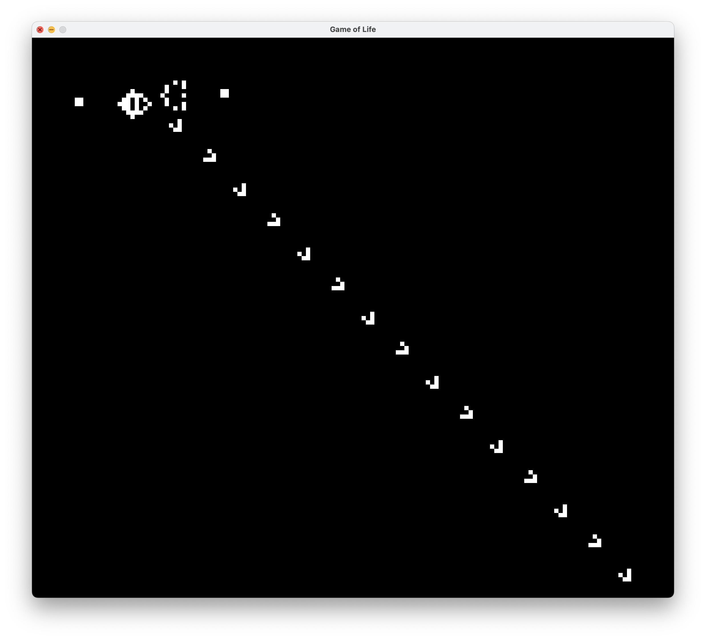

# Game-of-Life-Computer
A Game of Life simulation in Rust, and tools to build a working computer inside of it.


## Patterns
An [OCTA Metapixel](https://conwaylife.com/wiki/OTCA_metapixel):


A [Gosper Glider Gun](https://conwaylife.com/wiki/Gosper_glider_gun):


## Running
Launch the UI using:
```console
$ cargo run
```

The simulation will run. The commands are simple:
- Pause the simulation by pressing `Space`. Start it by pressing `Space` again.
- While the simulation is paused, click on a cell to invert it.

## License
This work is licensed under the [CC-BY-NC-SA 4.0](https://creativecommons.org/licenses/by-nc-sa/4.0/) license.